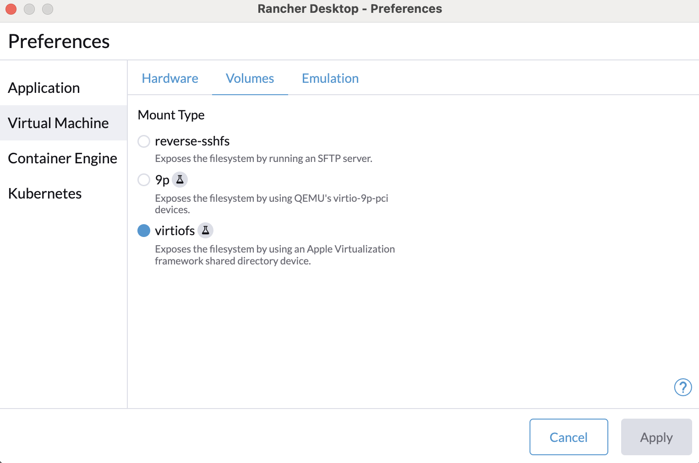
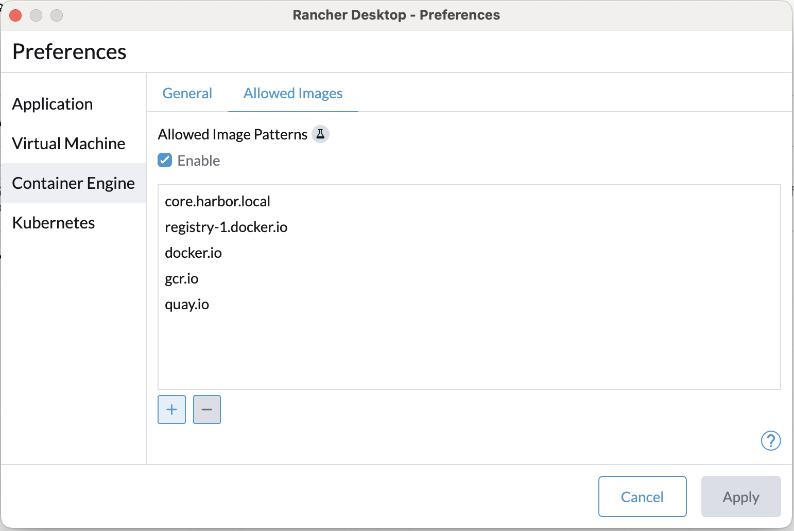
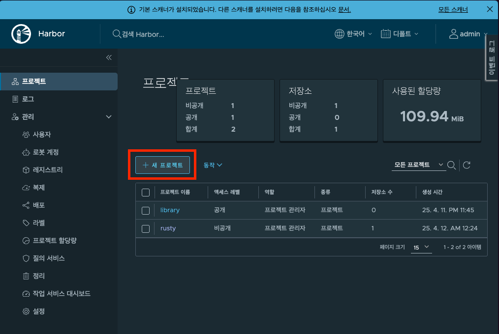

# harbor

docker compose를 통한 harbor 로컬 실행

helm chart를 통한 harbor 실행은 [여기](#helm-chart)를 참고

## locally started

### 0. offline installer download and install

https://github.com/goharbor/harbor/releases 여기에서 최신 버전 다운로드

> 현 기준 최신 버전은 v2.13.0

```bash
tar -xvzf harbor-offline-installer-v2.13.0.tgz
```

- `harbor` 폴더 하위에 아래에 파일 생성됨
- `harbor-example` 폴더 내 파일을 `harbor`로 덮어쓰기

### 1. harbor.yml

harbor configuration 등록

```bash
cd harbor
cp harbor.yml.tmpl harbor.yml
```

ssl key 생성을 위해 아래 command 실행

```bash
openssl req -x509 -nodes -days 365 \
  -newkey rsa:2048 \
  -keyout key.pem -out cert.pem \
  -config harbor-openssl.cnf
```

```yaml
hostname: core.harbor.local

http:
  port: 80

https:
  port: 443
  certificate: /Users/a78256/Documents/Workspaces/github.com/jhseo-git/harbor-helm-starter/harbor/ssl/cert.pem
  private_key: /Users/a78256/Documents/Workspaces/github.com/jhseo-git/harbor-helm-starter/harbor/ssl/key.pem
```

### 2. run install.sh

```bash
sudo ./install.sh
```

### 3. /etc/hosts

`/etc/hosts` 파일에 아래 내용 추가

```txt
127.0.0.1 core.harbor.local
```

```bash
cat /etc/hosts
# 127.0.0.1 core.harbor.local
```

### 4. core.harbor.local 접속

- https://core.harbor.local

#### ssl 경고

keychain에 `./ssl/cert.pem` 등록

```bash
sudo security add-trusted-cert -d -r trustRoot -k /Library/Keychains/System.keychain ./ssl/cert.pem
# core.harbor.local 로 저장
```

## trouble shooting

### ./install.sh 실행 시 chown: permission denied 등

Rancher Desktop에서 파일 시스템 문제로 인해 실행 시 권한 문제가 발생할 수 있습니다.

아래 이미지로 설정 후 재시동 되면 재시도



### rancher desktop allowed images

"is not covered by the Rancher Desktop allowed-images list" 같은 에러가 발생한다면 rancher desktop 설정에서 허용 이미지 목록에 추가



> 추가로 registry를 등록해서 사용

## Helm chart

<details>
<summary>Helm chart intrudction</summary>

## Prerequisites

다음 도구들이 로컬 환경에 설치되어 있어야 합니다:

- [Kubernetes](https://kubernetes.io/docs/setup/)
- [Helm](https://helm.sh/docs/intro/install/)
- [Docker](https://docs.docker.com/get-docker/)
- [Minikube](https://minikube.sigs.k8s.io/docs/start/)

## 0. local 실행 시

minikube 실행

- minikube: https://minikube.sigs.k8s.io/docs/start/?arch=%2Fmacos%2Farm64%2Fstable%2Fbinary+download
- 메모리는 6G 이상으로 설정

```bash
minikube start --memory=8192MB
minikube status
# minikube stop && minikube start --memory=8192MB --dns-domain=cluster.local --dns-proxy=true
```

## 1. harbor helm 설치

```bash
helm repo add harbor https://helm.goharbor.io
```

## 2. values.yaml

```bash
helm show values harbor/harbor > values.yaml
```

values.yaml 확인

## 3. install harbor

`harbor` namespace 추가

```bash
kubectl create namespace harbor
```

```bash
helm install harbor harbor/harbor -n harbor -f values.yaml
# helm uninstall harbor -n harbor

kubectl get -n harbor po -A
kubectl get -n harbor svc
```

### minikube docker image pull 실패 시

```bash
# 로컬에서 이미지 pull 후 minikube에 load
# goharbor/harbor-core:v2.12.2
# goharbor/harbor-db:v2.12.2
# goharbor/harbor-jobservice:v2.12.2
# goharbor/harbor-portal:v2.12.2
# goharbor/redis-photon:v2.12.2
# goharbor/harbor-registryctl:v2.12.2
# goharbor/registry-photon:v2.12.2
# goharbor/trivy-adapter-photon:v2.12.2

docker pull goharbor/harbor-core:v2.12.2 && minikube image load goharbor/harbor-core:v2.12.2
docker pull goharbor/harbor-db:v2.12.2 && minikube image load goharbor/harbor-db:v2.12.2
docker pull goharbor/harbor-jobservice:v2.12.2 && minikube image load goharbor/harbor-jobservice:v2.12.2
docker pull goharbor/harbor-portal:v2.12.2 && minikube image load goharbor/harbor-portal:v2.12.2
docker pull goharbor/redis-photon:v2.12.2 && minikube image load goharbor/redis-photon:v2.12.2
docker pull goharbor/harbor-registryctl:v2.12.2 && minikube image load goharbor/harbor-registryctl:v2.12.2
docker pull goharbor/registry-photon:v2.12.2 && minikube image load goharbor/registry-photon:v2.12.2
docker pull goharbor/trivy-adapter-photon:v2.12.2 && minikube image load goharbor/trivy-adapter-photon:v2.12.2
```

## 4. (chart 수정시) update harbor

```bash
helm upgrade harbor harbor/harbor -n harbor -f values.yaml
```

## 5. self-signed certificate

> helm을 통해 실행 시에는 ssl을 자동으로 생성하여 적용시키는데, 자동으로 생성된 인증서는 알려진 기관이 아니기 때문에 브라우저에서 접근 시도를 막습니다.  
> 이를 해결하기 위해 해당 ca.crt를 키체인에 등록합니다.  
> Caution: harbor 재실행되면 다시 등록해줘야 됩니다.

```bash
kubectl get secret -n harbor harbor-ingress -o jsonpath='{.data.ca\.crt}' | base64 -d > harbor-ca.crt
```

ca.crt를 키체인에 "시스템" 항목에 등록 후 인증서 "항상 신뢰"로 적용

### command

```bash
sudo security add-trusted-cert -d -r trustRoot -k /Library/Keychains/System.keychain harbor-ca.crt
```

## 6. minikube tunnel

```bash
minikube addons enable ingress
minikube tunnel
```

### minikube docker image pull 실패 시

`/etc/resolv.conf` 파일에 다음 내용을 추가 합니다.

```bash
minikube ssh

docker@minikube:~$ cat /etc/resolv.conf
nameserver 8.8.8.8
nameserver 8.8.4.4
docker@minikube:~$ nslookup registry-1.docker.io
Server:         8.8.8.8
Address:        8.8.8.8#53
```

## 7. /etc/hosts

```bash
kubectl get ing -n harbor
# NAME             CLASS    HOSTS                ADDRESS        PORTS     AGE
# harbor-ingress   <none>   core.harbor.domain   192.168.49.2   80, 443   18m

sudo vi /etc/hosts
# 192.168.49.2 core.harbor.domain
```

## 8. harbor 로그인

- `externalURL`: https://core.harbor.domain
- `harborAdminPassword`: Harbor12345

## 9. docker login to harbor(core.harbor.domain)

```bash
docker login core.harbor.domain -u admin
```

### ssl 오류 시

docker client(docker desktop, orbstack, rancher desktop 등)에서 신뢰할 수 없는 인증서로 인식되어 발생하는 문제입니다.
이를 해결하기 위해 "Settings"(또는 "Preferences")에서 config에 다음 옵션을 추가합니다.

```json
{
  "insecure-registries": ["core.harbor.domain"]
}
```

## 10. harbor: create a project

> harbor는 project단위로 이미지를 관리하기 때문에 이미지를 저장하기 위해서는 프로젝트를 생성해야 합니다.



## 11. docker tag

image name = `{harbor domain}/{project name}/{image name}`

예를 들어, 아래 정보라면

- harbor 도메인: core.harbor.domain
- project 명: app
- 이미지 명: my-app-image

docker tag는 다음과 같이 생성해야 합니다.

```bash
docker build -t core.harbor.domain/app/my-app-image .
# docker tag {origin-tag} core.harbor.domain/app/my-app-image
```

## 12. docker push

```bash
docker push core.harbor.domain/app/my-app-image
```

</details>
